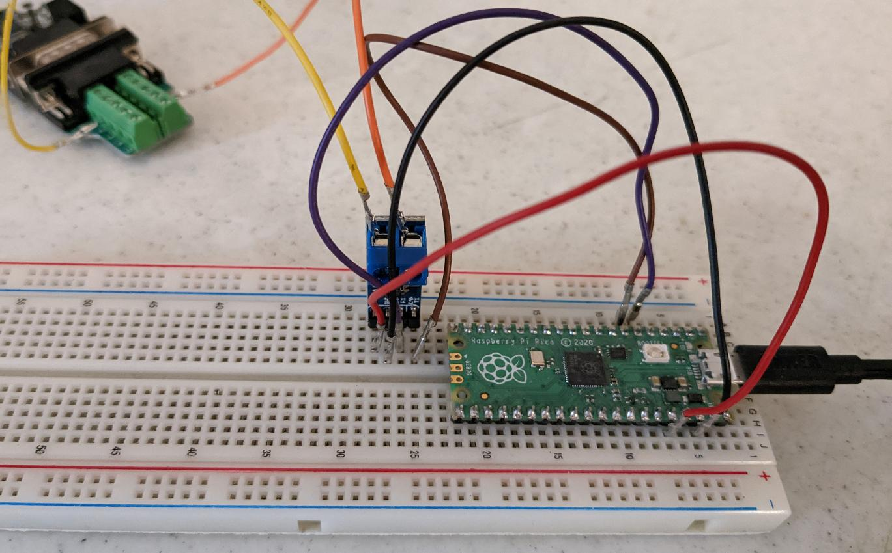

This document describes some available tools that may be useful for
testing and debugging the can2040 code.  These tools may also
facilitate development and may be useful as coding examples.

# Klipper

The [Klipper](https://www.klipper3d.org/) code utilizes can2040 for
micro-controller CAN bus communication on rp2040 chips.

Klipper can also be compiled in a [USB to CAN bus bridge
mode](https://www.klipper3d.org/CANBUS.html#usb-to-can-bus-bridge-mode)
so that an rp2040 device appears as a standard Linux USB to CAN bus
adapter (using the "gs_usb" Linux driver).  Compiling the Klipper
micro-controller code in this mode may be useful for CAN bus
diagnostics even when not using Klipper.  See the [Klipper
installation](https://www.klipper3d.org/Installation.html)
instructions for the full installation instructions.  Briefly, on a
Raspberry Pi computer the installation involves:
1. Download the Klipper code
   (`git clone https://github.com/Klipper3d/klipper`).
2. Install compiler tools
   (`sudo apt-get update && sudo apt-get install build-essential libncurses-dev libusb-dev libnewlib-arm-none-eabi gcc-arm-none-eabi binutils-arm-none-eabi libusb-1.0 pkg-config`).
3. Configure the micro-controller software (`make menuconfig`).
   Select "Enable extra low-level configuration options", select
   "Raspberry Pi RP2040" as the micro-controller, select "No
   bootloader", select "USB to CAN bus bridge", set the appropriate
   gpio pins for CAN RX and CAN TX, and set the desired CAN bus
   frequency.
4. Build the micro-controller software (`make`).
5. Place the rp2040 micro-controller in bootloader mode and flash the
   software (`make flash FLASH_DEVICE=2e8a:0003`).

Once the Klipper micro-controller code is running on the rp2040 it is
possible to use the Linux
[can-utils](https://github.com/linux-can/can-utils) tools.  Briefly:
1. Install the can-utils package
   (`sudo apt-get update && sudo apt-get install can-utils`).
2. Bring up the "can0" Linux interface
   (eg, `sudo ip link set can0 up type can bitrate 1000000`).  Note
   that Klipper currently uses the CAN bus frequency set during "make
   menuconfig" and the value set in Linux is ignored.
3. In one window run the candump utility to show all packets read by
   the interface (eg, `candump -t z -Ddex can0,#FFFFFFFF`).
4. In another window, send packets on the CAN bus
   (eg, `cansend can0 123#121212121212`).

# CanBoot

The [CanBoot](https://github.com/Arksine/CanBoot) code implements a
cross-platform bootloader that supports flashing an rp2040
micro-controller over CAN bus.  It utilizes can2040 on rp2040 chips.

# Testing CAN bus

Note that can2040 (and CAN bus in general) requires a functional
hardware bus for proper message generation.  At a minimum, can2040
requires a functioning transceiver, functioning "CAN H" and "CAN L"
wiring, two 120 Ohm resistors on that wiring, at least one additional
CAN bus enabled chip with its own transceiver, and all chips much be
configured with the same CAN bus frequency.  If any of the above
hardware is missing or not properly connected/configured then the bus
will not function correctly; not even for debugging purposes.

# Testing with Raspberry Pi Pico board

It is possible to use a Raspberry Pi Pico board with a CAN bus
transceiver board for testing.  The following picture shows an example
wiring with a "Waveshare SN65HVD230 CAN Board":

In the above picture, 3.3V on the transceiver board is wired to 3.3V
on the Pico, GND is wired to GND, CAN Rx is wired to GPIO4, and CAN Tx
is wired to GPIO5.  (Note that the "Waveshare SN65HVD230 CAN Board"
has a builtin 120 Ohm resistor between the CANH and CANL wires which
is not easy to remove.)

# Sigrok logic analyzer

The [Sigrok Pulseview](https://sigrok.org/wiki/PulseView) software
along with a low-cost logic analyzer can be useful for diagnosing CAN
bus signaling.

One can often find "USB logic analyzers" for under $15 (US pricing as
of 2023).  These devices are often listed as "Saleae logic clones" or
as "24MHz 8 channel USB logic analyzers".

The above picture was taken while using pulseview with a "Saleae
clone" logic analyzer.  The Sigrok and pulseview software was
installed on a desktop machine (also install the "fx2lafw" firmware if
that is packaged separately).  The CH0 pin on the logic analyzer was
routed to the rp2040 CAN Rx line, the CH1 pin was wired to the CAN Tx
pin, and GND was wired to GND.  Pulseview was configured to only
display the D0 and D1 lines (red "probe" icon center top toolbar).
The number of samples was set to 5 million (top toolbar) and the
sample rate was set to 24Mhz (top toolbar).  The CAN decoder was added
(yellow and green "bubble icon" right top toolbar).  The D0 channel
was labeled as RX and set to trigger on a falling edge (click on black
D0 label at left).  The D1 channel was labeled as TX (click on brown
D1 label at left).  The CAN decoder was configured for 1Mbit rate
(click on green CAN label at left).  The CAN decoder was moved to the
top of the display (click and drag green CAN label).  Finally, the
capture was started (click "Run" at top left) and a packet was
transmitted on the CAN bus (`cansend can0 123#121212121212`).

The logic analyzer can provide an independent tool for capturing
packets and verifying bit timing.
